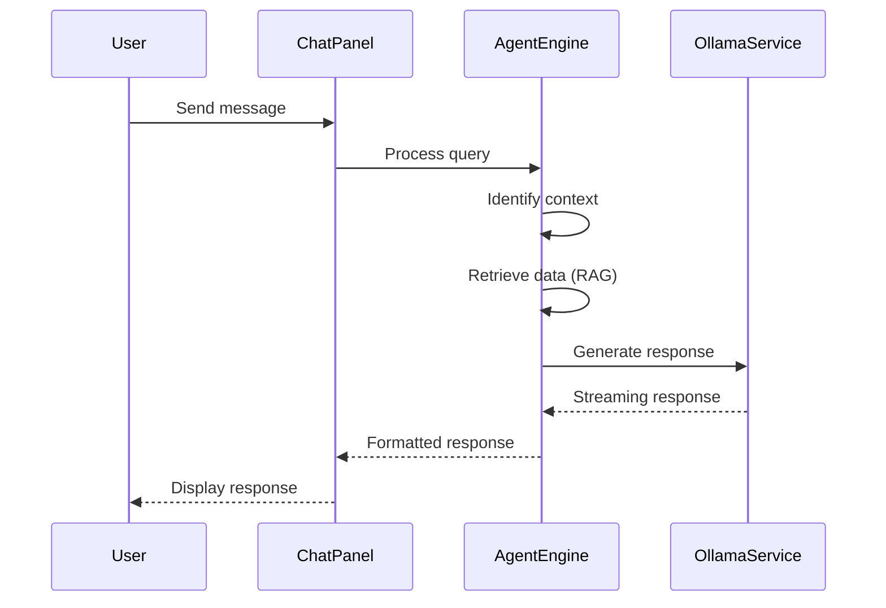
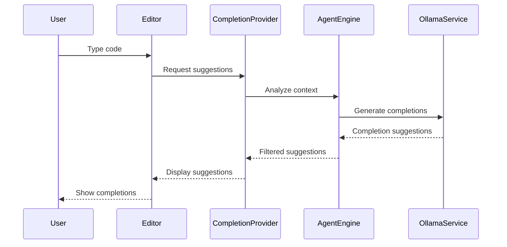
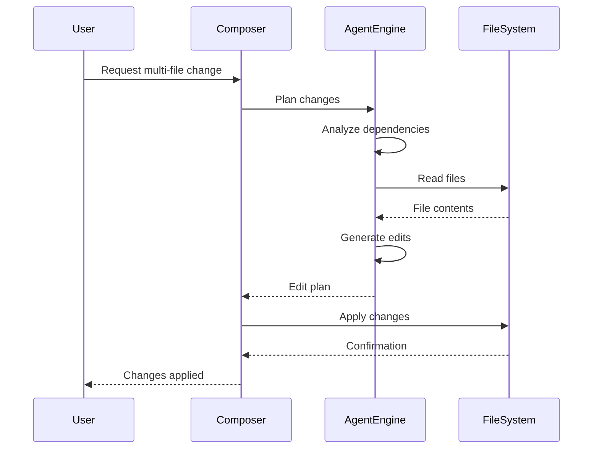
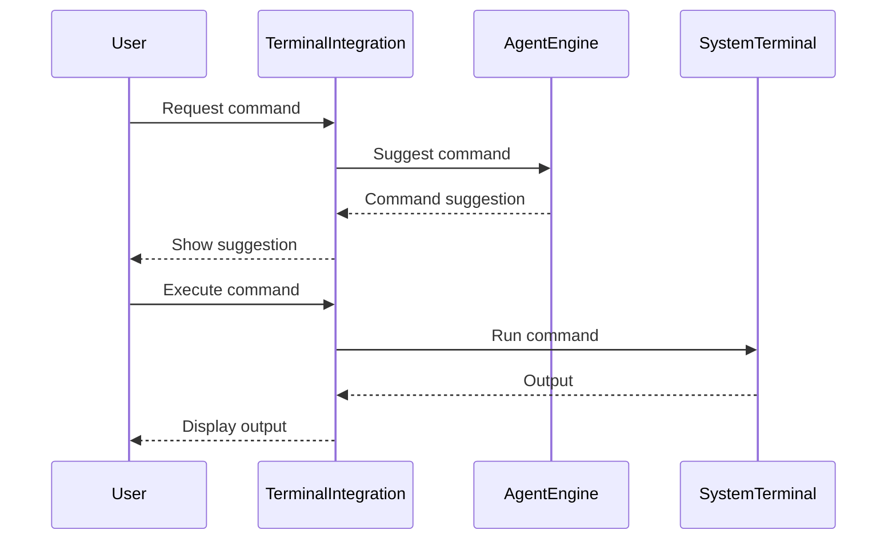
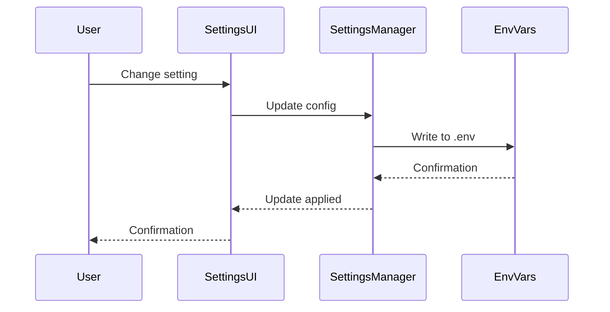
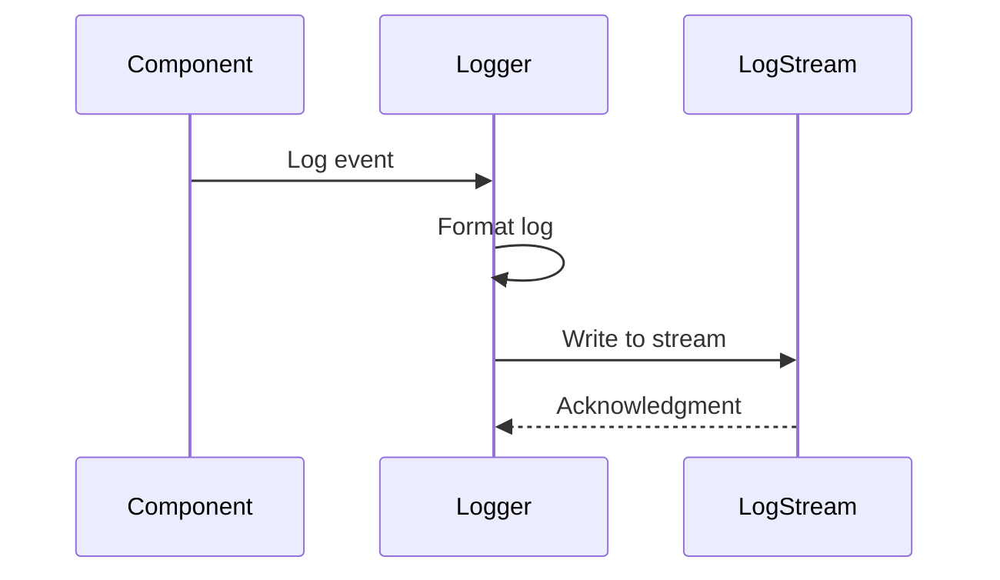
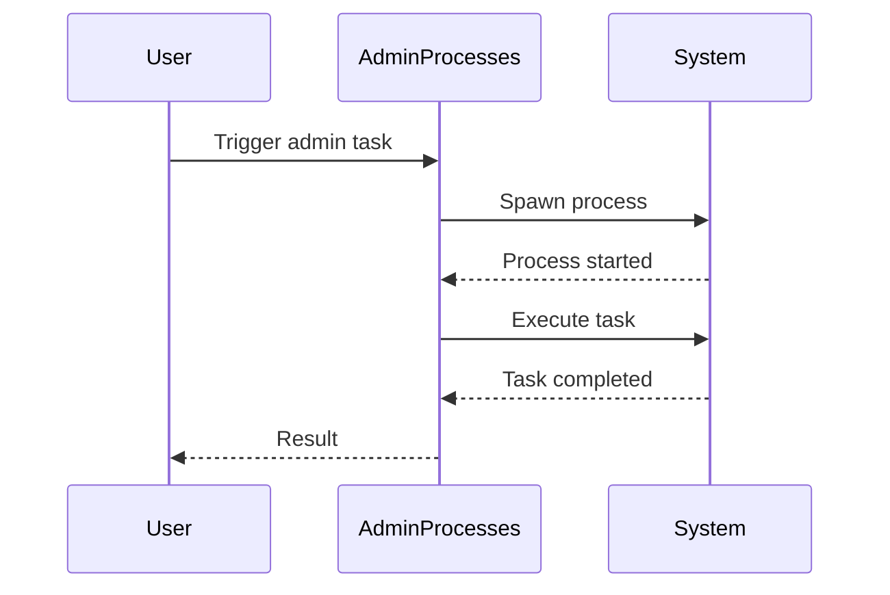

# NMFA Features Documentation

## AI Chat

Provides an interactive chat interface for coding assistance.

### Sequence Diagram

## Inline Code Completion

Offers real-time code suggestions as the user types.

### Sequence Diagram

## Multi-File Editing (Composer)

Allows AI-assisted editing across multiple files.

### Sequence Diagram

## Terminal Integration

Integrates AI assistance with terminal commands.

### Sequence Diagram

## Settings Management

Handles configuration via environment variables.

### Sequence Diagram

## Logging

Implements event stream logging.

### Sequence Diagram

## Admin Processes

Runs administrative tasks as one-off processes.

### Sequence Diagram

